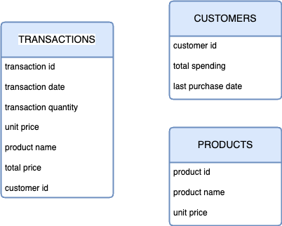
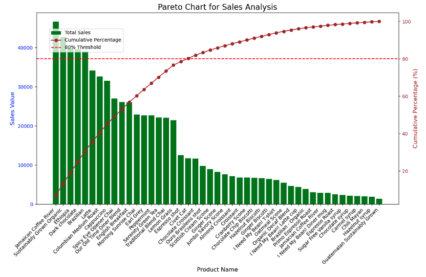
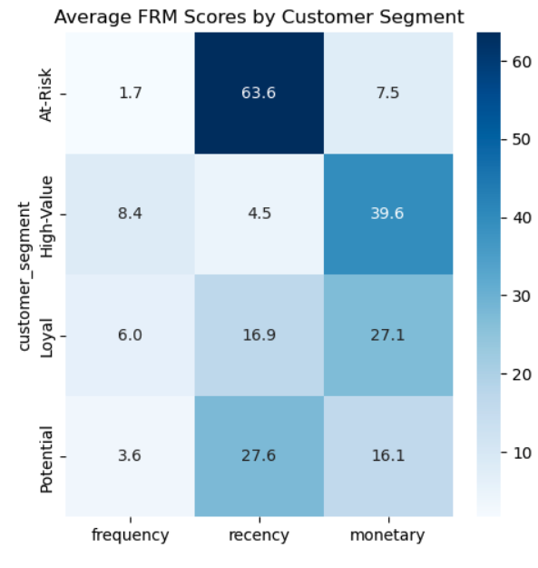
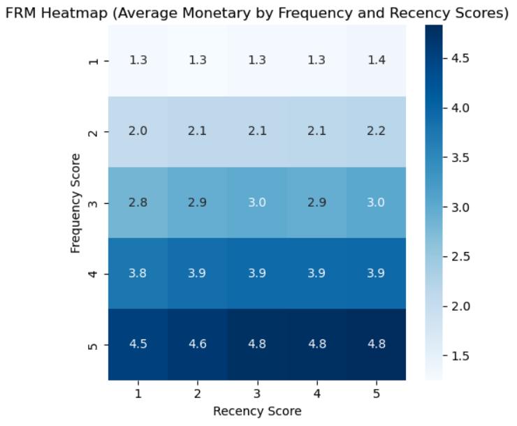

# ABC & RFM Analysis for Coffee Shop Business Optimization

## Project Overview

This project aims to perform **ABC analysis** on products and **RFM analysis** on customers to help a coffee shop optimize its business strategy.  
With a menu of 20+ products and a growing customer base, the shop seeks to understand which products generate the most revenue and which customer groups bring the most value, so as to improve inventory planning and customer retention.

### Objectives:
- Classify products based on their contribution to total revenue using **ABC analysis**
- Segment customers based on **Recency, Frequency, and Monetary (RFM)** scores
- Identify behavioral patterns, key metrics, and strategic insights
- Recommend data-driven actions to improve revenue, inventory management, and customer loyalty

---

## Dataset Structure

The database includes 3 tables:

1. **`transaction`** (~150K rows, 19 columns)  
   Contains detailed transactional data (date, product ID, quantity, price, customer ID, etc.)

2. **`customer`** (3 columns)  
   Basic customer profile including unique ID, joining date, and demographic information

3. **`product`** (4 columns)  
   Product ID, product name, category, and price

---

## Insights Summary

### ABC Analysis on Products

| Class | % of Total Products | % of Total Revenue | Key Characteristics |
|-------|----------------------|---------------------|----------------------|
| A     | 40%                  | 78.45%              | Top-selling products; major revenue contributors |
| B     | 31.1%                | ~16% (est.)         | Moderate sales and revenue contribution |
| C     | 28.9%                | ~5%                 | Low-performing products in terms of revenue |

- **Key Insight:** A small number of products (Class A) drive the majority of revenue, while Class C products contribute very little.

---

### RFM Analysis on Customers

#### 1. Customer Behavior by Segment:

- **High-Value Segment**:  
  - Highest average frequency and spending per transaction  
  - Visit the coffee shop frequently and spend more each time

- **Loyal Segment**:  
  - Frequently visit the shop with recent purchases  
  - Slightly lower average spending than High-Value group

- **Potential Segment**:  
  - Recently active customers with lower visit frequency  
  - High potential to be converted to loyal customers

- **At-Risk Segment**:  
  - Previously active but no recent purchases  
  - High churn risk; currently least engaged

#### 2. Customer Metrics Breakdown:

- **Monetary Score** is highly influenced by **Frequency** over **Recency**
- Highest scores (dark blue on heatmap) concentrate at **F = 5, R = 5**
- Low scores (light blue) appear at **F = 1, R = 1**

#### 3. Customer Distribution by Segment:

| Segment      | % of Total Customers | Revenue Contribution | Avg. Spending |
|--------------|----------------------|-----------------------|----------------|
| At-Risk      | Highest              | Second highest        | Lowest         |
| Loyal        | High                 | **Highest**           | Moderate       |
| High-Value   | Lower in number      | High (per capita)     | **Highest**    |
| Potential    | Moderate             | Low                   | Low            |

---

## Recommendations

### Product Strategy (ABC Analysis):

- **Class A Products**
  - Prioritize stock management to prevent stockouts
  - Use for flagship promotions and main campaigns

- **Class B Products**
  - Consider improving product quality or packaging
  - Revisit pricing strategy to increase competitiveness

- **Class C Products**
  - Bundle with Class A in promotions (e.g. “Buy a Latte mug, get a Latte free”)
  - Consider eliminating underperforming SKUs to reduce costs

---

### Customer Strategy (RFM Analysis):

#### At-Risk Customers:
- Launch **Win-Back Campaigns** via emails or mobile notifications with exclusive offers
- Send **feedback surveys** to understand disengagement reasons
- Offer reactivation discounts or reminders

#### Potential Customers:
- Introduce **Upselling/Cross-selling** bundles (e.g. "Complete Your Set", "You May Also Like")
- Enroll in **subscription or loyalty programs** with:
  - Points accumulation
  - Gifts redemption
  - Free drinks after X visits

#### Loyal & High-Value Customers:
- Implement **Referral Programs** with discounts or reward points
- Collect feedback from them to enhance service quality
- Offer **VIP perks**:
  - Birthday/Anniversary gifts
  - Early access to new products
  - Surprise thank-you notes or gifts

---

## Key Takeaways

- A small number of products and customers contribute most to the revenue
- Customer segmentation based on RFM reveals distinct behavioral patterns
- Using data-backed strategies can greatly increase retention, average ticket size, and overall profitability

